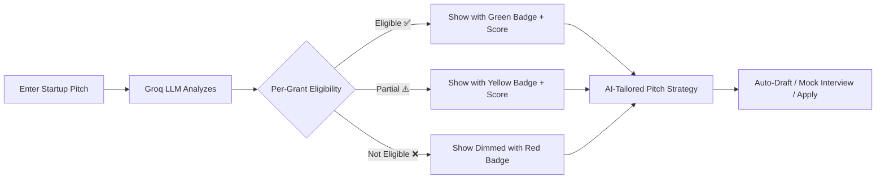

# 🚀 GrantMatch.ai — AI-Powered Government Grant Matching Platform

> **Neurathon Project** — An intelligent platform that helps Indian startups discover, match, and apply for government grants and funding schemes using AI.

---

## 📌 Problem Statement

Indian startups waste months manually searching through hundreds of government schemes (NIDHI-PRAYAS, Startup India Seed Fund, BIRAC BIG, etc.) to find relevant funding. The process is:
- **Fragmented** — Grants are spread across 20+ ministries and agencies
- **Opaque** — Eligibility criteria are buried in 50-page PDFs
- **Time-consuming** — Founders spend weeks instead of building their product

## 💡 Our Solution

**GrantMatch.ai** is an AI-powered platform that:
1. **Analyzes** your startup pitch using Groq LLM (Large Language Model)
2. **Matches** it against 12+ real Indian government grant schemes
3. **Categorizes** grants as ✅ Eligible, ⚠️ Partially Eligible, or ❌ Not Eligible
4. **Generates** tailored pitch strategies per grant to maximize funding chances
5. **Auto-drafts** government-format application proposals with one click
6. **Simulates** mock grant interviews with an AI Nodal Officer

---

## ✨ Key Features

| Feature | Description |
|---|---|
| **AI Pitch Analysis** | Enter your startup idea → AI analyzes eligibility across all 12 government schemes |
| **Smart Grant Matching** | Semantic matching (not just keywords) based on startup stage, domain, and legal status |
| **Eligibility Scoring** | 0–100% score per grant with AI-generated reasoning |
| **AI-Rewritten Pitch Strategy** | Tailored pitch improvements per grant to increase application success rate |
| **Auto-Draft Application** | One-click generation of government-format proposal (IGAS Form 1-A) with typewriter animation |
| **PDF Export** | Download auto-drafted applications as formatted PDF documents |
| **Mock Grant Interview** | AI Nodal Officer conducts a live, streaming mock scrutiny interview (3 rounds + verdict) |
| **DigiLocker Authentication** | India Stack-based identity verification via Aadhaar OTP flow |
| **Eligibility Modal** | Detailed eligibility breakdown (Stage, Status, Sector matching) per grant |
| **Burn Rate Simulator** | Visual chart showing startup runway impact with/without grant funding |
| **Multi-language Support** | UI supports English, Hindi (हिन्दी), and Tamil (தமிழ்) |
| **Voice Input** | Speech-to-text for pitch entry |
| **Grant Radar Chart** | Spider/radar visualization of grant-fit dimensions (Innovation, Feasibility, Market, Team, Scale) |
| **Ask AI** | Per-grant conversational AI chat for grant-specific questions |
| **Real Portal Links** | Direct links to official government grant portals |
| **Dark/Light Mode** | Theme toggle on landing page |

---

## 🏗️ Tech Stack

| Layer | Technology |
|---|---|
| **Framework** | [Next.js 14](https://nextjs.org/) (App Router) |
| **Language** | TypeScript |
| **UI Library** | React 18 |
| **Styling** | Tailwind CSS 3 |
| **AI/LLM** | [Groq SDK](https://groq.com/) — Llama 4 Scout (17B) for pitch analysis, GPT-OSS-120B for mock interviews |
| **Animations** | Framer Motion |
| **Charts** | Recharts |
| **PDF Generation** | jsPDF |
| **Icons** | Lucide React |
| **Confetti Effects** | canvas-confetti |
| **Authentication** | Custom AuthContext (demo mode) + DigiLocker flow |

---

## 📁 Project Structure

```
grant-match-ai/
├── app/
│   ├── api/
│   │   ├── analyze-pitch/       # AI pitch analysis endpoint (Groq LLM)
│   │   │   └── route.ts
│   │   └── mock-interview/      # AI mock interview endpoint (streaming)
│   │       └── route.ts
│   ├── dashboard/
│   │   └── page.tsx             # Main dashboard (pitch input, grant cards, stats)
│   ├── login/
│   │   └── page.tsx             # Login page (Google + DigiLocker)
│   ├── page.tsx                 # Landing page (hero, features, CTA)
│   ├── layout.tsx               # Root layout with AuthProvider
│   └── globals.css              # Global styles
├── components/
│   ├── AiJuryModal.tsx          # Mock grant interview with streaming AI
│   ├── ActivityFeed.tsx         # Live marquee news ticker
│   ├── DigiLockerBadge.tsx      # DigiLocker verification badge
│   ├── DigiLockerModal.tsx      # Aadhaar-based identity verification
│   ├── DraftPreviewModal.tsx    # Auto-drafted application with typewriter effect
│   ├── EligibilityModal.tsx     # Eligibility scoring breakdown
│   ├── GrantCard.tsx            # Individual grant card (actions, radar, strategy)
│   ├── GrantChat.tsx            # Per-grant AI chat assistant
│   ├── GrantRadar.tsx           # Spider chart for grant fit analysis
│   ├── RunwayChart.tsx          # Burn rate simulator chart
│   └── ui/                     # Shared UI primitives
├── context/
│   └── AuthContext.tsx          # Global auth and profile state
├── lib/
│   └── smartMock.ts             # 12 real Indian grant schemes + matching logic
├── public/                      # Static assets
├── .env.local                   # Environment variables (GROQ_API_KEY)
├── package.json
├── tailwind.config.js
├── tsconfig.json
└── next.config.mjs
```

---

## 🚀 Getting Started

### Prerequisites
- **Node.js** ≥ 18.x
- **npm** ≥ 9.x
- **Groq API Key** (get one at [console.groq.com](https://console.groq.com/))

### Installation

```bash
# 1. Clone the repository
git clone https://github.com/your-username/grant-match-ai.git
cd grant-match-ai

# 2. Install dependencies
npm install

# 3. Configure environment variables
# Create .env.local in the project root with:
GROQ_API_KEY=your_groq_api_key_here

# 4. Start the development server
npm run dev
```

Open [http://localhost:3000](http://localhost:3000) in your browser.

---

## 🔑 Environment Variables

| Variable | Description | Required |
|---|---|---|
| `GROQ_API_KEY` | API key for Groq LLM (used for pitch analysis and mock interviews) | ✅ Yes |

---

## 📊 Grant Database

The platform currently indexes **12 real Indian government grant/funding schemes**:

| # | Scheme | Agency | Amount | Sector |
|---|---|---|---|---|
| 1 | NIDHI-PRAYAS | DST | ₹10 Lakhs | DeepTech |
| 2 | Startup India Seed Fund | DPIIT | ₹20–50 Lakhs | General |
| 3 | BIRAC BIG Scheme | BIRAC | ₹50 Lakhs | Healthcare |
| 4 | RKVY-RAFTAAR | Min. of Agriculture | ₹25 Lakhs | AgriTech |
| 5 | Women Entrepreneurship Platform | NITI Aayog | ₹15 Lakhs | Women-Led |
| 6 | TIDE 2.0 | MeitY | ₹7 Lakhs | IT/Software |
| 7 | MUDRA Loan (Shishu) | SIDBI | ₹50K–10 Lakhs | Micro Enterprise |
| 8 | Atal Innovation Mission | NITI Aayog | ₹10 Cr | Innovation |
| 9 | Stand-Up India | Min. of Finance | ₹10L–1 Cr | SC/ST/Women |
| 10 | iDEX – Defence Innovation | Min. of Defence | ₹1.5 Cr | Defence/Aerospace |
| 11 | MSME Credit Linked Subsidy | Min. of MSME | ₹15 Lakhs | Manufacturing |
| 12 | CGTMSE Credit Guarantee | MSME/SIDBI | ₹5 Cr | MSME |

---

## 🔄 How It Works



1. **User enters** their startup idea in the pitch textarea
2. **AI analyzes** the pitch against all 12 government schemes via Groq LLM
3. **Results display** — grants categorized as Eligible / Partially Eligible / Not Eligible
4. **Each grant card shows** — eligibility badge, match score (0–100%), AI reasoning, and a tailored pitch strategy
5. **User can** auto-draft applications, run mock interviews, check detailed eligibility, or visit official portals

---

## 🛡️ India Stack Integration

- **DigiLocker** — Aadhaar-based identity verification for trusted founder authentication
- **DPIIT Recognition** — References in auto-drafted applications
- **Government Portal Links** — Direct links to official grant portals

---

## 📜 API Routes

| Endpoint | Method | Description |
|---|---|---|
| `/api/analyze-pitch` | POST | Sends pitch + grants to Groq LLM, returns per-grant eligibility analysis |
| `/api/mock-interview` | POST | Streaming mock interview with AI Nodal Officer (SSE) |

---

## 🧪 Running in Production

```bash
# Build for production
npm run build

# Start the production server
npm start
```

---

## 👥 Team

| Name | Role |
|---|---|
| *Add team member names* | *Add roles* |

---

## 📄 License

This project was built for the **Neurathon Hackathon**. All rights reserved.

---

<p align="center">
  Built with ❤️ using Next.js, Groq AI, and India Stack
</p>
